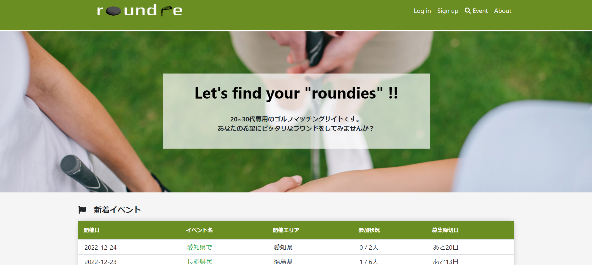

# Roundie(ラウンディ)

## サイト概要
### サイトテーマ
　ラウンドのイベントを作成したり、イベントに参加して
　見知らぬゴルフ好き（バディ）とラウンドができる、20～30代専用のゴルフ仲間を探すマッチングサイト

### テーマを選んだ理由
　私自身がゴルフ好きで、50代以上の方とラウンドに行くことはよくありましたが、同じレベルでラウンドできる同年代や同性のゴルフ仲間が少なく、
　ゴルフコミュニティを広げられるサービスがあったらいいなと思いこちらのテーマにしました。
　また、昨今ゴルフを始める若者が多いことに着目し、会社の上司と回るために練習したい！コンペで恥をかきたくない！など、若者特融の悩みに
　アプローチするために対象の年齢層を絞りました。

### ターゲットユーザー
　20~30代のゴルフ好きの若者

### 主な利用シーン
　ゴルフ好きな友達が欲しい！ / ゴルフに行きたいが、周りに予定の合う友達がいない / ゴルフを始めたばかりで、上司と回る前に練習ラウンドがしたい ・・・
　などと思った時
　
# 機能
* 顧客側

1 ログイン機能
* メールアドレス、パスワードでログインできる。

2 ログアウト機能
* ログインしている状態からログアウト状態にする。
* ログイン時のみ利用できる機能が利用できなくなる。

3 新規会員登録機能
* 会員登録では、氏名/ニックネーム/生年月日/性別/メールアドレス/パスワードで登録ができる。

4 会員情報編集機能
* 登録している情報を編集することができる。
* 新規登録画面では、入力しなかった項目を入力することができる。

5 退会機能(Gem不使用)
* 退会手続きをすることができる。

6 イベント機能
* イベント一覧が表示される。
* 検索結果を表示する場合は、検索条件に当てはまるイベントのみ一覧表示する。
* イベントの新規作成ができる。
* イベントを作成するにはプロフィール編集より、プロフィールの詳細を入力する必要がある。
* イベントの作成は一般的なゴルフ場のキャンセル規定を参考に、締切日は開催日より8日前以上で作成することができる。
* イベントに参加するにはイベント主催者に"申請"し、イベント主催者が"承認"することでイベントに参加することができる。
* イベント主催者が"却下"した場合は、イベントに参加することができない。

7 イベント詳細機能
* イベントに参加している参加者が表示される。
* イベント参加者にのみ、コメント欄が表示される。
* イベント参加者以外には、主催者へのDMリンクが表示される。

8 フォロー機能
* フォローする/外すことができる。

9 DM機能（チャット）
* 会員の詳細画面からDMを送信することができる。
* DM一覧が表示される。

10 通知機能
* イベントの申請結果/フォロー/DM/コメントについて通知される。
* 通知を確認すると、背景が変わり、既読の確認ができる。

11 ゲストログイン機能
* ログイン画面のゲストログインよりログインできる。
* ゲストはプロフィールの編集・退会が不可能。

* 管理者側

1 ログイン機能
* 管理者専用のメールアドレス、パスワードでログインできる。

2 ログアウト機能
* ログインしている状態からログアウト状態にする。
* ログイン時のみ利用できる機能が利用できなくなる。

3 イベント機能
* 会員が登録したイベントの一覧を閲覧することができる。

4 イベント詳細機能
* イベントに参加している参加者が表示される。
* イベントを終了させることができる。

5 会員一覧機能
* 登録履歴のある会員をすべて閲覧できる。
* 

6 会員詳細機能
* 会員についての詳細を確認することができる。
* 会員の登録状態を有効/退会のいずれかに変更することができる。

※7 ゲストログイン機能
* ポートフォリオ用にゲストログイン機能を作成。

## 開発環境
- OS：Linux(CentOS)
- 言語：HTML,CSS,JavaScript,Ruby,SQL
- フレームワーク：Ruby on Rails
- JSライブラリ：jQuery
- IDE：Cloud9

## 使用素材
* Canva(https://www.canva.com/)
* Font awesome(https://fontawesome.com/)